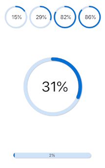

## Custom UIView Animation Test Project

Shows how to animate properties in an Custom UIView using an
draw method provided by a [paintcode](https://www.paintcodeapp.com) stylekit.

Everything relevant is in [CustomProgressView.swift](AnimationTest/CustomProgressView.swift)